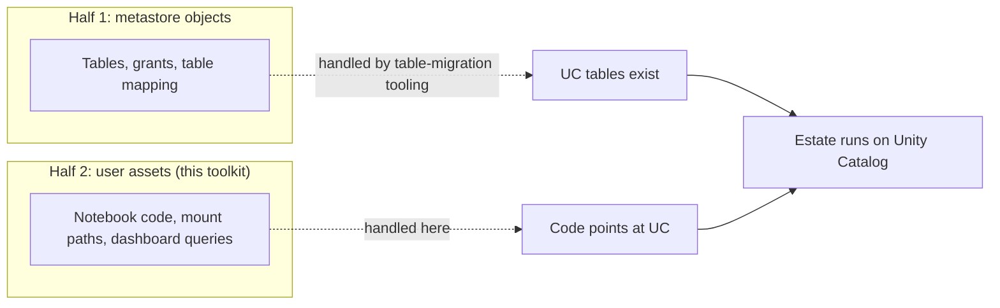
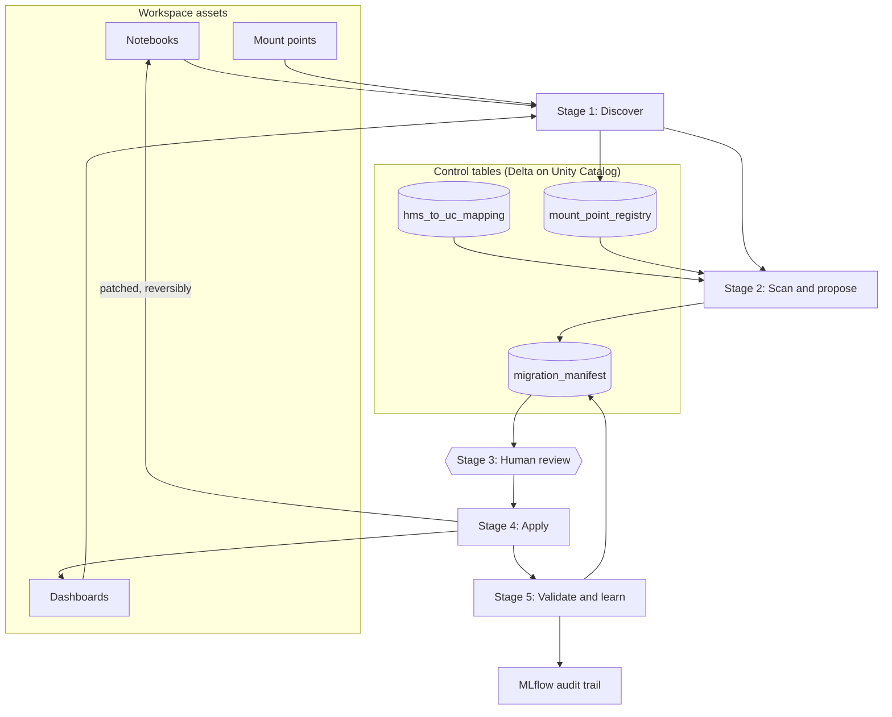
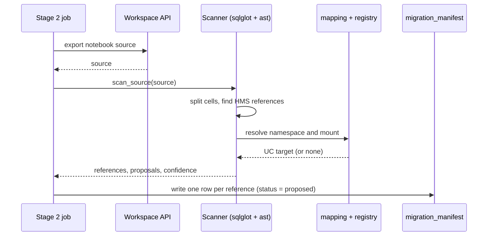
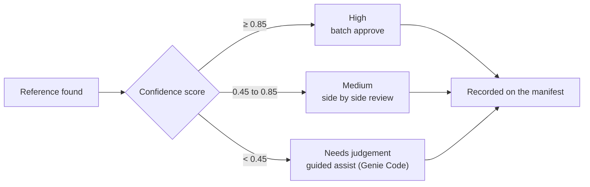
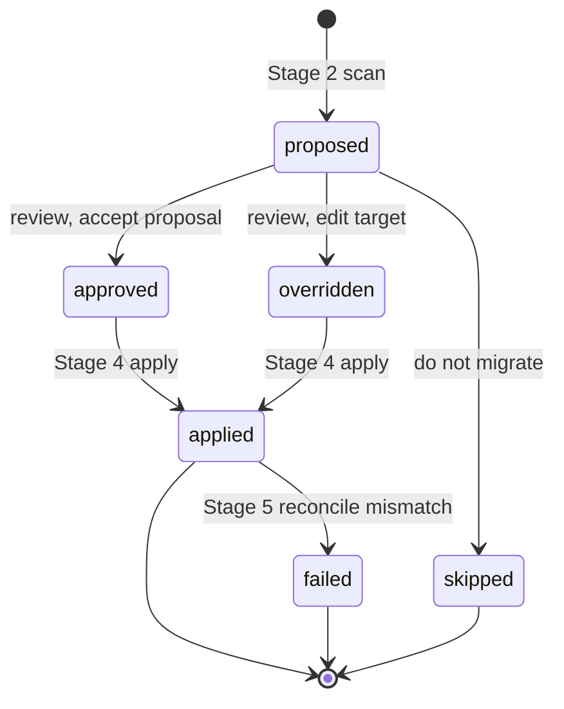

# databricks-hms-uc-migration

> Migrate the **user assets** that a table migration leaves behind. When your tables move from
> Hive Metastore to Unity Catalog, the notebooks, dashboards, and scripts that reference them
> still point at the old names and `/mnt` paths, and they break. This toolkit finds those
> references, proposes the new targets with explainable confidence scores, routes them through
> a human review, patches the assets in place reversibly, and reconciles the result.


---

## Contents

- [What this is](#what-this-is)
- [The two halves of UC migration](#the-two-halves-of-uc-migration)
- [Architecture](#architecture)
- [How a single asset is scanned](#how-a-single-asset-is-scanned)
- [Confidence decides the review effort](#confidence-decides-the-review-effort)
- [The manifest lifecycle](#the-manifest-lifecycle)
- [Step by step](#step-by-step)
- [Reference kinds and scoring](#reference-kinds-and-scoring)
- [Repository layout](#repository-layout)
- [Testing](#testing)
- [Documentation](#documentation)
- [Author](#author)
- [License](#license)

---

## What this is

A toolkit and agent skill that migrates user assets from Hive Metastore (HMS) to Unity Catalog
(UC). It does not migrate tables. Moving tables, grants, and the metastore mapping is the other
half of UC migration, handled by table-migration tooling. This complements that work and
patches the code that references those tables.

Everything runs inside your own workspace with no external egress. Confidence is rule based and
explainable, not a model, and nothing below high confidence is applied without a human
approving it. References built at runtime are flagged for review rather than skipped, so the
tool never silently misses code it cannot resolve.

## The two halves of UC migration



## Architecture

Five stages over four Delta control tables. Stages 1, 2, 4, and 5 are scripts you run as jobs
or locally. Stage 3 is interactive: notebooks plus a Genie Code skill, driven by a reviewer.



## How a single asset is scanned

The scanner is pure Python: `sqlglot` for SQL cells, the standard library `ast` for Python
cells. It has no Databricks dependency, so its rules are unit tested offline.



## Confidence decides the review effort



## The manifest lifecycle

Every reference is one row in `migration_manifest`. Its status moves through the flow:



## Step by step

```bash
pip install databricks-sdk sqlglot mlflow ipywidgets
```

1. **Create the control tables.** One schema, four Delta tables. DDL is in
   [`references/pipeline-stages.md`](references/pipeline-stages.md).
2. **Seed the mapping.** Populate `hms_to_uc_mapping` with your HMS to UC answer key, or feed
   it from your table-migration output.
3. **(Optional) seed a synthetic estate** to trial the flow end to end:
   ```bash
   python3 scripts/setup/seed_demo_assets.py --profile <profile> \
     --catalog <catalog> --schema <schema> \
     --demo-root /Workspace/Shared/hms_uc_migration_demo/demo_notebooks
   ```
4. **Discover.**
   ```bash
   python3 scripts/jobs/stage1_discovery.py --profile <profile> --catalog <catalog> --schema <schema>
   ```
5. **Scan and propose.**
   ```bash
   python3 scripts/jobs/stage2_scan_propose.py --profile <profile> --catalog <catalog> --schema <schema>
   ```
6. **Review.** Open `scripts/review/review_simple.py` to batch approve the high-confidence tier,
   `scripts/review/review_complex.py` for the side by side tier, and the
   `scripts/workspace_skill/hms-migration-review` Genie Code skill for the judgement tier.
7. **Apply.**
   ```bash
   python3 scripts/jobs/stage4_apply.py --profile <profile> --catalog <catalog> --schema <schema>
   ```
8. **Validate and record.**
   ```bash
   python3 scripts/jobs/stage5_validate.py --profile <profile> --catalog <catalog> --schema <schema>
   ```

Run the same stages as workspace jobs through the bundle, or locally with a CLI profile as
shown. Every script reads `--catalog`, `--schema`, and where relevant `--demo-root`,
`--warehouse-id`, and `--profile`. Nothing environment-specific is hardcoded. The full
walkthrough with verification queries and troubleshooting is in
[`docs/HMS_UC_MIGRATION_RUNBOOK.html`](docs/HMS_UC_MIGRATION_RUNBOOK.html).

## Reference kinds and scoring

| Reference kind | Example | Typical score |
|----------------|---------|---------------|
| `sql_table_ref` | `SELECT ... FROM risk_db.exposures` | 0.95 on exact mapping hit |
| `py_table_ref` | `spark.read.table("sales_db.transactions")` | 0.95 on exact mapping hit |
| `mount_path_literal` | `spark.read.parquet("/mnt/sales-raw/2024")` | 0.90 if the mount resolves |
| `dynamic_mount` | `f"/mnt/{name}/daily"` | 0.70, registry non-empty |
| `dynamic_table` | `spark.table(f"{db}.gl_accounts")` | 0.30, built at runtime |
| any | no mapping hit or unknown namespace | 0.20 |

Table references become `uc_catalog.uc_schema.uc_table`. Mount literals become a UC Volumes path
that preserves the sub-path. Dynamic references carry no proposal and wait for the reviewer.

## Repository layout

```
SKILL.md             Agent skill entry point (parent: databricks-core)
references/          Stage details, scanner rules, confidence model, review, API recipes, audit
scripts/
  scanner/           Pure-Python reference extraction and scoring (sqlglot + ast)
  jobs/              The five stage jobs
  review/            Stage 3 review notebooks
  setup/             Synthetic estate generator
  workspace_skill/   Genie Code review skill for the judgement tier
tests/               Scanner unit tests (test-first)
docs/                Operational runbook (HTML)
```

## Testing

The scanner has no Databricks dependency, so its rules run offline.

```bash
pytest tests/
```

## Documentation

- [`SKILL.md`](SKILL.md) and [`references/`](references/) are the full operating guide.
- [`docs/HMS_UC_MIGRATION_RUNBOOK.html`](docs/HMS_UC_MIGRATION_RUNBOOK.html) is a step by step
  operational runbook with the actual commands, verification queries, and troubleshooting.

## Author

**Lingeshwaran Kanniappan** &middot; [LinkedIn](https://www.linkedin.com/in/lingeshwarankanniappan/)

Contributions and issues are welcome.

## License

Apache License 2.0. See [`LICENSE`](LICENSE).
